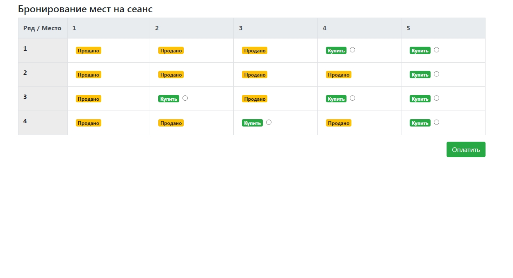
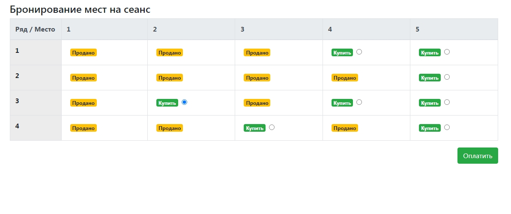
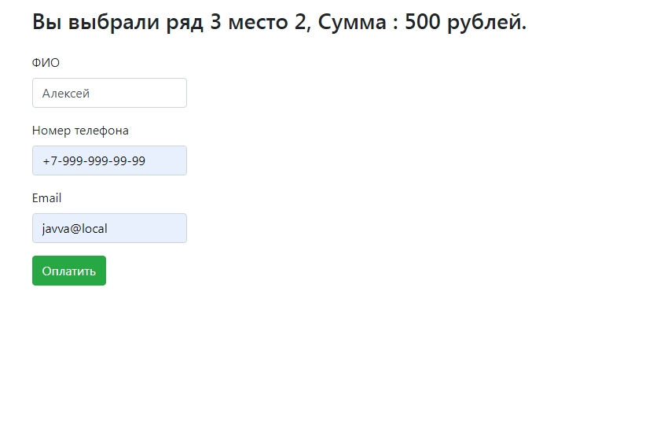
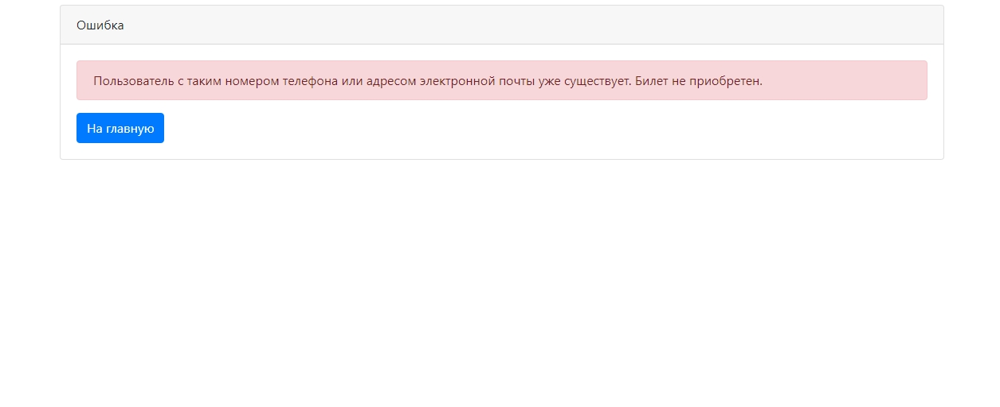
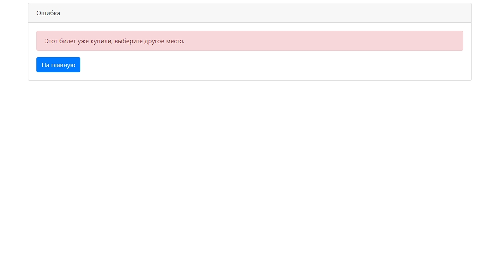

Это приложение можно использовать для заказа билетов в кинотеатре.

Пользователь может увидеть зал

Выбрать место

Оплатить билет

Если пользователь существует, то будет выдано сообщение

Если билет уже куплен, будет выдано сообщение

Успешное приобретение билета

